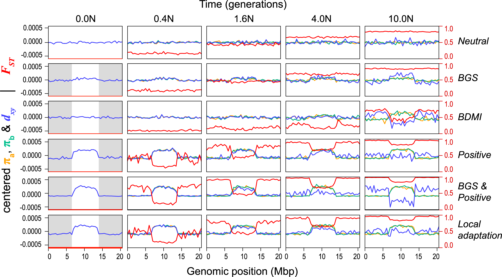
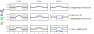

# Outline

## Outline of the talk

1. Big picture
2. Tools
3. Applications

# Adaptation, and genetic variation

<!--
## Sickle-cell (HbS) allele frequencies

Human sickle-cell allele (HbS):
(Currat et al 2002)

- Single base substitution
- provides protection against malaria 
  (but deleterious in homozygotes)
-->

## G6PD deficiency allele frequencies

Human G6PD variants *(Howes et al 2013)*

- over 130 G6PD deficiency alleles; 
    34 variants at high frequency
- provide protection against malaria 
    but increase risk of anemia
- Estimated ages 40-400 generations

## 

{width=70%}

- Dark-pigmented mammals and reptiles on volcanic outcrops in the Southwest. (Dice, Benson 1936)
- 'Dark' allele beneficial on outcrops, deleterious elsewhere. 
- MC1R: basis is shared *between species* but not *between populations* (Nachman, Hoekstra)

## "isolation by distance"

::: {.caption}
by [CJ Battey](cjbattey.com)
:::

##

- genetic versus geographic distance between pairs of 272 desert tortoises (McCartney-Melstad, Shaffer)
- clouds are comparisons within/between the two colors

## 

How much of the genome is under selection?

# Genomic landscapes

##

## Diversity correlates with recombination rate

:::: {.columns}
:::::::: {.column width=80%}

{width=85%}

::::
:::::::: {.column width=20%}

*Hudson 1994; Cutter & Payseur 2013; Corbett-Detig et al 2015*

::::
::::::::

--------------

linked selection

: The indirect effects of selection on genomic locations
  that are *linked* to the sites under selection by a lack of recombination.

::: {.centered}

{.fragment width="40%"}
{.fragment width="40%"}

:::

## The *Mimulus aurantiacus* species complex

::: {.centered}

:::

------------------

::: {.centered}
{width=70%}
:::

----------------------

:::: {.columns}
:::::::: {.column width=40%}

::::::::::: {.caption}
From *Widespread selection and gene flow shape the genomic landscape during a radiation of monkeyflowers*,
Stankowski, Chase, Fuiten, Rodrigues, Ralph, and Streisfeld;
PLoS Bio 2019.
:::::::::::

::: {.centered}
{width=45%}
{width=45%}
{width=50%}
:::

::::
:::::::: {.column width=60%}

::::
::::::::

-------------------------

The data:

- chromosome-level genome assembly
- $20\times$ coverage of 8 taxa and outgroup (*M.clevelandii*)
- diversity ($\pi$), divergence ($d_{xy}$),
    and differentiation ($F_{ST}$) in windows
- 36 pairwise comparisons among 9 taxa
- estimates of recombination rate and gene density
    from map and annotation

-------------------

::: {.centered}
{width=50%}
:::

-------------------

$$
\begin{aligned}
\pi &= \text{ (within-pop genetic distance) } \\
d_{xy} &= \text{ (between-pop genetic distance) }
\end{aligned}
$$

::: {.centered}

{width=60%}

:::

--------------------------

:::: {.columns}
:::::::: {.column width=80%}

::::
:::::::: {.column width=20%}

{width="250%"}

::::
::::::::

---------------------

:::: {.columns}
:::::::: {.column width=80%}

::::
:::::::: {.column width=20%}

{width="250%"}

::::
::::::::

---------------------

:::: {.columns}
:::::::: {.column width=80%}

::::
:::::::: {.column width=20%}

{width="250%"}

::::
::::::::

---------------------

:::: {.columns}
:::::::: {.column width=80%}

::::
:::::::: {.column width=20%}

{width="250%"}

::::
::::::::

<!--
---------------------

:::: {.columns}
:::::::: {.column width=80%}

::::
:::::::: {.column width=20%}

{width="250%"}

::::
::::::::
-->

---------------------

:::: {.columns}
:::::::: {.column width=80%}

::::
:::::::: {.column width=20%}

{width="250%"}

::::
::::::::

---------------------

:::: {.columns}
:::::::: {.column width=80%}

::::
:::::::: {.column width=20%}

{width="250%"}

::::
::::::::

---------------------

:::: {.columns}
:::::::: {.column width=80%}

::::
:::::::: {.column width=20%}

{width="250%"}

::::
::::::::

# Some questions

## Ok, then: selection.

:::: {.columns}
:::::::: {.column width=50%}

**But:** what kind of selection?

- newly adaptive variants?
- purifying selection?
- local adaptation?
- selection for introgression?

::::
:::::::: {.column width=50%}

::::
::::::::

--------------

To test theories and fit models, we need *simulations* with realistic

1. population sizes,
2. genomes,
3. selective pressures,
4. histories, and
5. geography.

## {data-background-image="figs/oregon_geological_map.png"}

<!-- Tree sequences -->

# The tree sequence

## History is a sequence of trees

For a set of sampled chromosomes,
at each position along the genome there is a genealogical tree
that says how they are related.

. . .

----------------------

The **tree sequence** is a way to describe this, er, sequence of trees.

---------------

---------------

---------------

-------------

[Kelleher, Etheridge, and McVean](http://journals.plos.org/ploscompbiol/article?id=10.1371/journal.pcbi.1004842) 
introduced the **tree sequence** data structure
for a fast coalescent simulator, [msprime](https://github.com/jeromekelleher/msprime).

- stores sequence *and* genealogical data **very** efficiently

- tree-based sequence storage closely related to haplotype-matching compression

- [`tskit`](https://github.com/tskit-dev/tskit) : python/C tools

::: {.columns}
:::::: {.column width=50%}

{width=80%}

:::
:::::: {.column width=50%}

::: {.floatright}
{width=50%}

:::: {.caption}
jerome kelleher
::::

:::

:::
::::::

## File sizes

::: {.centered}
{width=90%}
:::

::: {.caption}
from [Kelleher et al 2018, *Inferring whole-genome histories in large population datasets*](https://www.nature.com/articles/s41588-019-0483-y), Nature Genetics
:::

<!-- Estimated sizes of files required to store the genetic variation data for a
simulated human-like chromosome (100 megabases) for up to 10 billion haploid
(5 billion diploid) samples. Simulations were run for 10 1 up to 10 7 haplotypes
using msprime [Kelleher et al., 2016], and the sizes of the resulting files plotted
(points). -->

## Computation run time

::: {.centered}
{width=70%}
:::

::: {.caption}
from Ralph, Thornton and Kelleher 2019, [Efficiently summarizing relationships in large samples](https://doi.org/10.1534/genetics.120.303253)
:::

# Application to genomic simulations

## The main idea

If we *record the tree sequence*
that relates everyone to everyone else,

after the simulation is over we can put neutral mutations down on the trees.

. . .

Since neutral mutations don't affect demography,

this is *equivalent* to having kept track of them throughout.

. . .

:::: {.columns}
:::::::: {.column width=50%}

:::: {.caption}
From 
Kelleher, Thornton, Ashander, and Ralph 2018,
[Efficient pedigree recording for fast population genetics simulation](https://journals.plos.org/ploscompbiol/article?id=10.1371/journal.pcbi.1006581).

and Haller, Galloway, Kelleher, Messer, and Ralph 2018,
[*Tree‐sequence recording in SLiM opens new horizons for forward‐time simulation of whole genomes*](https://onlinelibrary.wiley.com/doi/abs/10.1111/1755-0998.12968)
:::

::::
:::::::: {.column width=50%}

::: {.floatright}
{width=35%}
{width=30%}
{width=30%}
:::

::::
::::::::

------------

This means recording the entire genetic history of **everyone** in the population, **ever**.

.  . .

It is *not* clear this is a good idea.

. . .

But, with a few tricks...

## A 100x speedup!

::: {.columns}
:::::: {.column width=40%}

::: {.centered}
{width=100%}
:::

<!--
{data-background-image="figs/slim_timing_no_msprime.png" data-background-size=40% data-background-position=left}
-->

:::
:::::: {.column width=60%}

::: {.floatright}
{width=100%}
:::

:::
::::::

## What else can you do with tree sequences?

> - recorded pedigree and migration history
> - true ancestry assignment
> - *recapitation*: fast, post-hoc initialization with coalescent simulation 
> - fast, convenient computation

---------------------

---------------------

**For example:**

- genome as human chr7 ($1.54 \times 10^8$bp)
- $\approx$ 10,000 diploids
- 500,000 overlapping generations
- continuous, square habitat
- selected mutations at rate $10^{-10}$
- neutral mutations added afterwards

*Runtime:* 8 hours

# Back to Mimulus

## The data

:::: {.columns}
:::::::: {.column width=80%}

::::
:::::::: {.column width=20%}

{width="250%"}

::::
::::::::

## Simulations

::: {.columns}
::::::: {.column width="70%"}

- $N=10,000$ diploids
- burn-in for $10N$ generations
- population split, with either:
    
    * neutral
    * background selection
    * selection against introgressed alleles
    * positive selection
    * local adaptation

:::
::::::: {.column width="30%"}

:::: {.flushright}

::::: {.caption}
Murillo Rodrigues
:::::
::::

:::
:::::::

------------------

<!--
Fig 7. Genomic landscapes simulated under different divergence histories.
Each row of plots shows patterns of within- and between-population variation (π, dxy, and FST) across the chromosome (500-kb windows) at 5 time points (N generations, where N = 10,000) during one of the scenarios The selection parameter (Ns, where s = Ns/N), proportion of deleterious (−) and positive mutations (+), and number of migrants per generation (Nm; 0 unless stated) for these simulations are as follows: (i) neutral divergence (no selection), (ii) BGS (−Ns = 100; −prop = 0.1), (iii) BDMI (−Ns = 100, −prop = 0.05, Nm = 0.1), (iv) positive selection (+Ns = 100, +prop = 0.001), (v) BGS and positive selection (−Ns = 100, −prop = 0.1; +Ns = 100, +prop = 0.005), and (vi) local adaptation (+Ns = 100, +prop = 0.001, Nm = 0.1). The gray boxes in the first column show the areas of the chromosome that are experiencing selection, while the white central area evolves neutrally. Note that π (in populations a and b) and dxy have been mean centered so they can be viewed on the same scale. Uncentered values and additional simulations with different parameter combinations and more time points can be found in S13 Fig. BDMI, Bateson-Dobzhansky-Muller incompatibility; BGS, background selection.

-->

{width=100%}

::::: {.flushright}

::::::::::: {.caption}
From [Widespread selection and gene flow shape the genomic landscape during a radiation of monkeyflowers](https://doi.org/10.1371/journal.pbio.3000391),
Stankowski, Chase, Fuiten, Rodrigues, Ralph, and Streisfeld;
PLoS Bio 2019.
:::::::::::
:::::

------------

Conclusions:

* <strike>neutral</strike>
* <strike>background selection</strike>
* <strike>selection against introgressed alleles</strike>
* positive selection
* local adaptation

# Wrap-up

## Bigger picture

How strongly does selection enhance or constrain genetic variation?

. . .

How much genetic variation is locally adaptive?

. . .

How will populations respond to changes in the future?

## Other uses for population simulation

::: {.columns}
:::::: {.column width=50%}

- train inference methods

- predict management outcomes

- do power analyses

- develop intuition

:::
:::::: {.column width=50%}

::: {.centered}
{width=60%}

{width=100%}
:::

:::
::::::

## {data-background-image="figs/slim_screenshot.png" data-background-position=center data-background-size=100%}

## 

:::: {.columns}
:::::::: {.column width=50%}

The Co-Lab:

- Andy Kern
- Matt Lukac
- Murillo Rodrigues 
- Jared Galloway
- CJ Battey

Funding:

- NIH NIGMS
- NSF DBI
- Sloan foundation
- UO Data Science

::::
:::::::: {.column width=50%}

Other collaborators:

- Jerome Kelleher
- Ben Haller
- Ben Jeffery
- Georgia Tsambos
- Jaime Ashander
- Gideon Bradburd
- Madeline Chase
- Bill Cresko
- Alison Etheridge
- Evan McCartney-Melstad
- Brad Shaffer
- Sean Stankowski
- Matt Streisfeld
- Anastasia Teterina

::::
::::::::

## {data-background-image="figs/guillemots_thanks.png" data-background-position=center data-background-size=50%}
